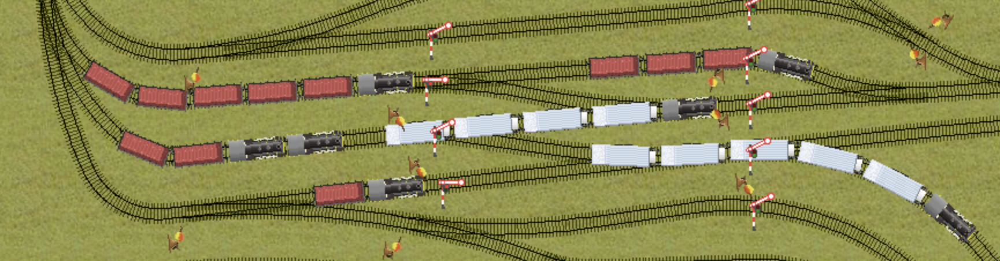

# Bahnhof
In this railway system simulator, your task is to build a logistics system to optimize the production, distribution and consumption of beer.


Features include an automated signaling system, advanced switching including coupling and decoupling, a routing system to program train behavior, and fully simulated rail dynamics. 
More will follow.

### Build
This project requires SDL2, SDL2_image, and SDL2_ttf, available at https://www.libsdl.org/

On Unix systems, the libraries are automatically found and linked if they are installed in a standard location. 
For Windows you need to manually edit the `SDL2_PATH`, `SDL2_IMAGE_PATH`, and `SDL2_TTF_PATH` in CMakeLists.txt to wherever you have installed each of these libraries.

Create a `build` folder in this directory, then use cmake to generate the makefile and the binary:

```
mkdir build
cmake -S . -B build
cmake --build build
```

and run the binary with 
```
cd build
./bahnhof
```
### Gameplay
Breweries require either hops or barley from farms to produce beer. 
Beer should be delivered to cities to generate income.
Wagons must stop within the designated areas and be ordered to unload/load all cargo via the train's route.

When editing a route, left click on a piece of track to generate an order to travel there. 
Left click on a switch to order setting the switch to its current state. 
The train must be assigned to the route and ordered to execute it via its UI panel.

Signals allow a routed train passage if the way up to the next signal is unblocked. 
Only one train is allowed passage at a time. 
The signaling system must be designed to prevent deadlocks; for example, build double tracks. 

The maximal train speed is determined by the curve radius, the locomotive orientation and whether the locomotive travels first in the train. 
You can couple more locomotives after one another to haul longer trains faster.

### Contributing
This is work in progress and much will change as the project develops. 
Feel free to submit a pull request if you'd like to contribute and become a part of the project.

Joar Axås 2026
